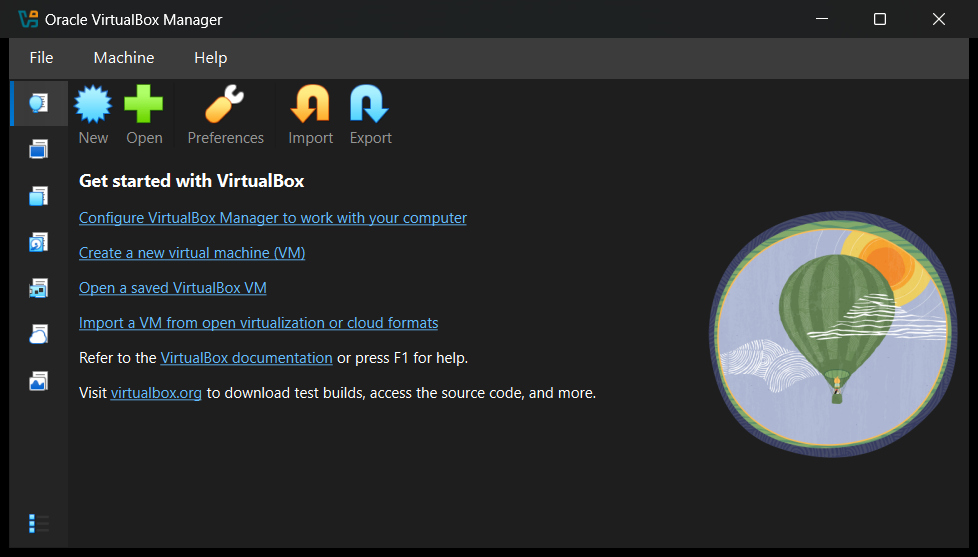
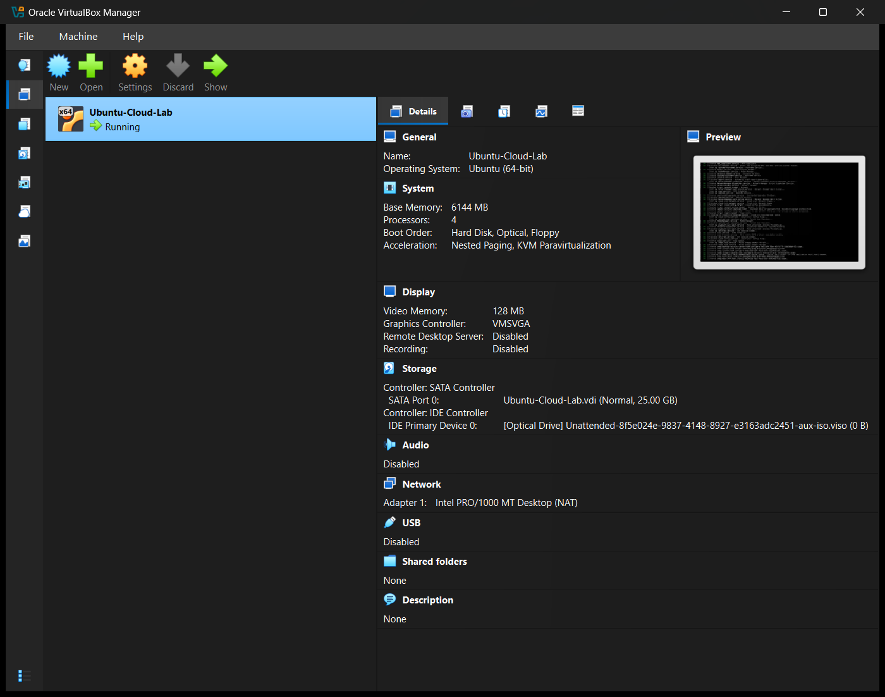
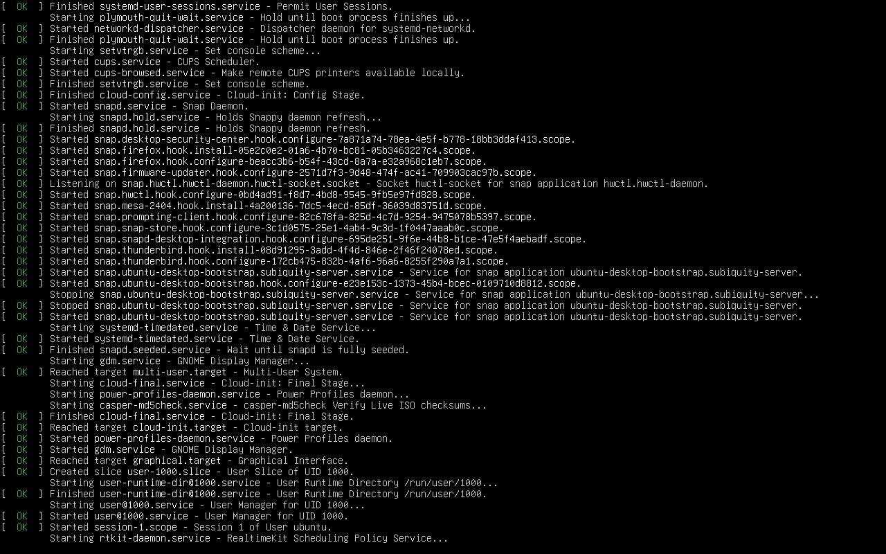
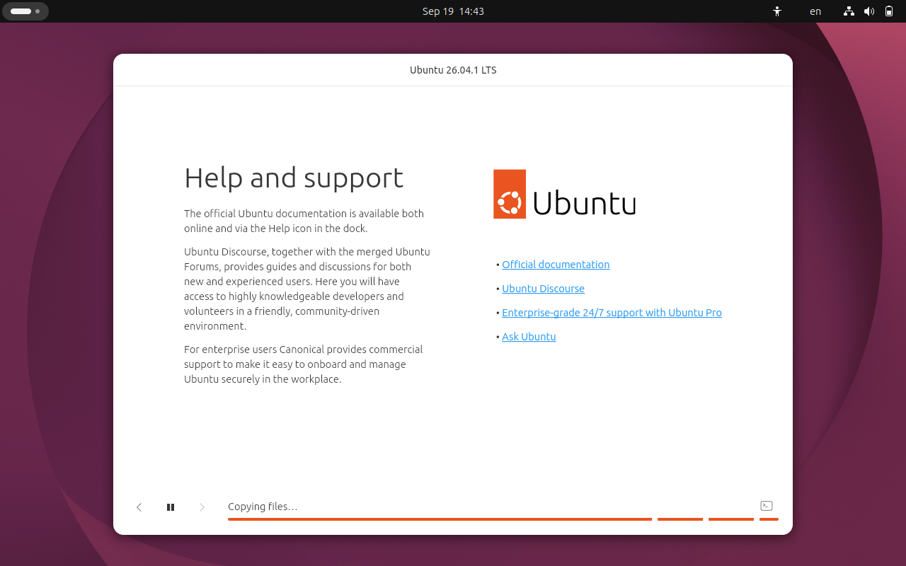
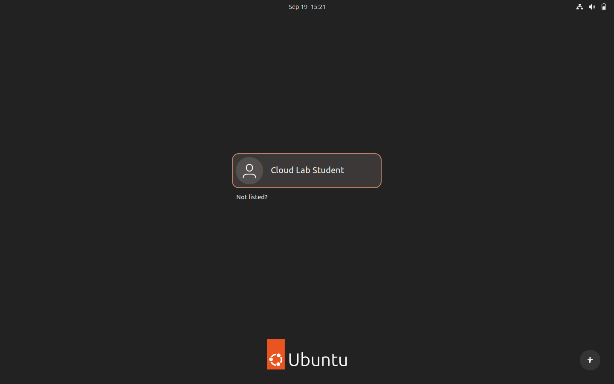
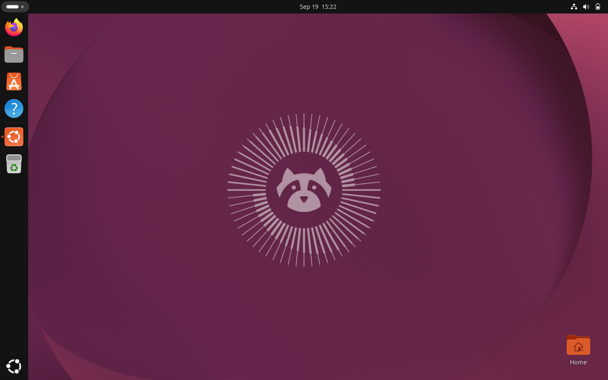
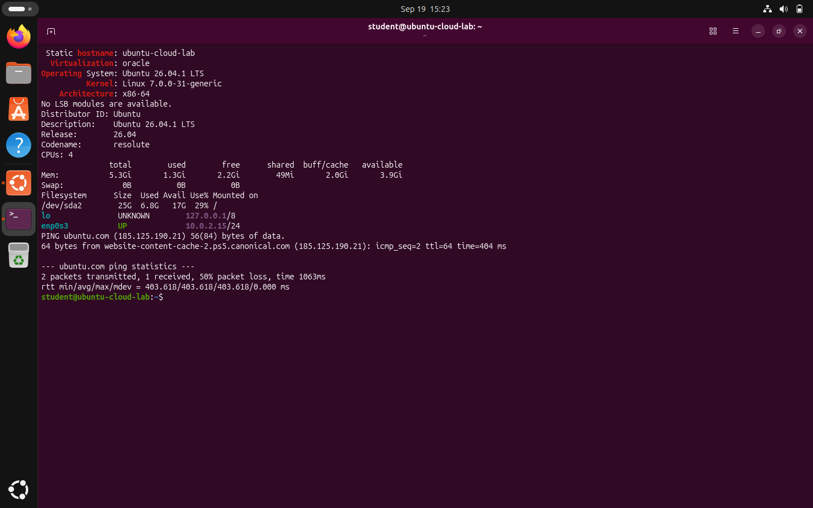
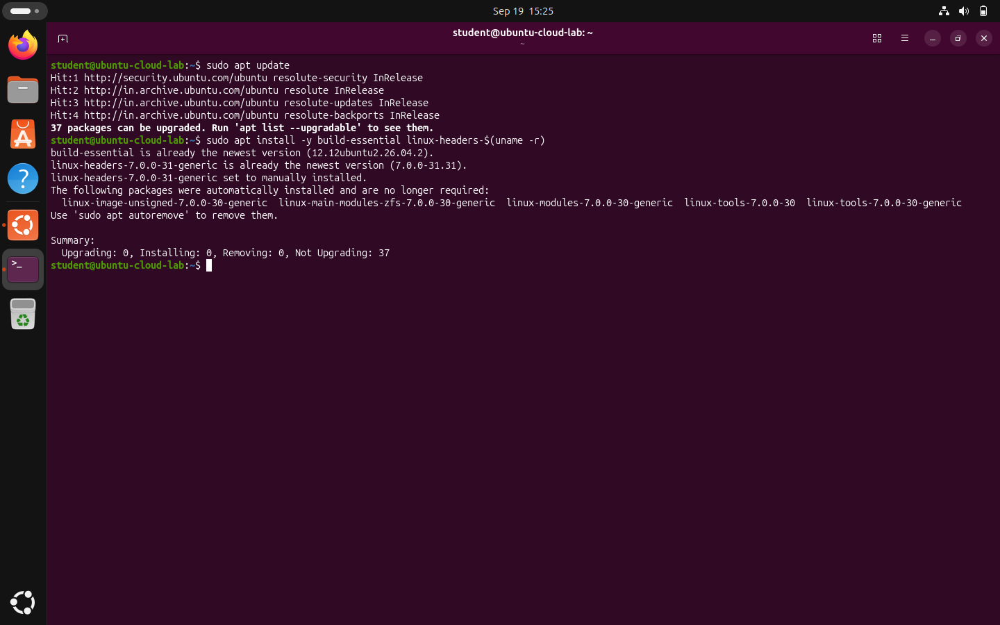
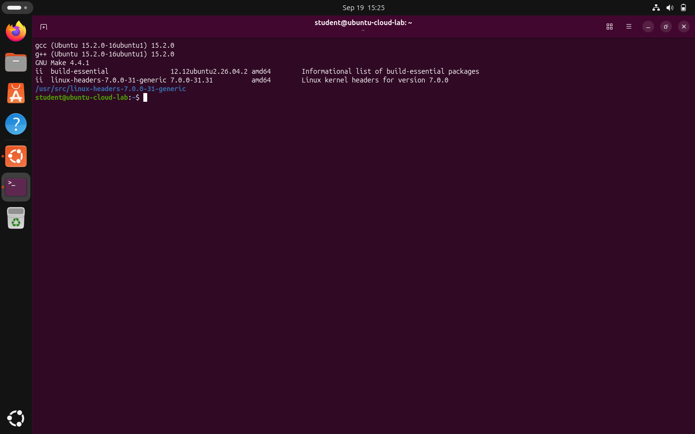
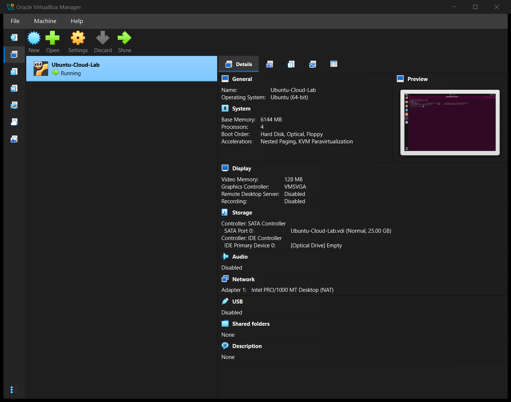

# Cloud Computing Lab — Experiment 1

## Installation of Hypervisors and Initiation of VMs with Image File

| Field | Details |
| --- | --- |
| Name | TODO: Add your name |
| Roll Number | TODO: Add your roll number |
| Section | BTECH_CSE_SECB_2023 |
| Course | Cloud Computing Lab |
| University | Adamas University (CSE, SOET) |
| Date of completion | 19 September 2026 |

## 1. Aim

Install and configure an open-source hypervisor and create/instantiate a Virtual Machine (VM) using an existing image file. Demonstrate the successful installation and execution of the VM.

## 2. Theory

A **hypervisor** (Virtual Machine Monitor) is software that creates and runs virtual machines by abstracting the physical CPU, memory, storage and network of a host and sharing them among isolated guest operating systems.

- **Type 1 (bare-metal)** hypervisors run directly on hardware (e.g. VMware ESXi, Microsoft Hyper-V, KVM, Xen).
- **Type 2 (hosted)** hypervisors run as an application on top of a host OS (e.g. Oracle VirtualBox, VMware Workstation).

**Oracle VirtualBox** is a free, open-source (GPLv3) Type 2 hypervisor. It uses hardware virtualization extensions (Intel VT-x / AMD-V) and nested paging to run guest operating systems at near-native speed. On this Windows 11 host, where the Windows Hypervisor Platform (Hyper-V) is active, VirtualBox runs the VM through the Hyper-V backend.

Virtualization is the foundation of cloud computing (IaaS): cloud providers such as AWS EC2, Azure VMs and Google Compute Engine provision VMs from **images** in exactly the same way this lab creates a VM from an ISO image.

## 3. Requirements

### Host system

| Item | Value |
| --- | --- |
| Host OS | Microsoft Windows 11 Home Single Language, 64-bit |
| CPU | 12th Gen Intel Core i7-12700H (14 cores / 20 threads) |
| RAM | 16 GB (15.63 GB usable) |
| Free disk space | 255 GB on R: drive |

### Software

| Software | Version | Source |
| --- | --- | --- |
| Oracle VirtualBox (hypervisor) | 7.2.18 r175117 | https://www.virtualbox.org/wiki/Downloads |
| Ubuntu Desktop ISO (guest image) | 26.04.1 LTS "Resolute Raccoon", amd64 | https://ubuntu.com/download/desktop |

ISO integrity was verified against Canonical's official `SHA256SUMS` file:

```text
601e30fbf5d97759367c632e2c33630665039b7e2158fd068403da3ccf1bda1f  ubuntu-26.04.1-desktop-amd64.iso   (match: OK)
```

## 4. VM Configuration

| Setting | Value |
| --- | --- |
| VM name | Ubuntu-Cloud-Lab |
| Type / Version | Linux / Ubuntu (64-bit) |
| Firmware | BIOS |
| CPU | 4 virtual CPUs |
| RAM | 6144 MB |
| Video memory / controller | 128 MB / VMSVGA |
| Storage controller | SATA (AHCI) + IDE (optical) |
| Virtual hard disk | `Ubuntu-Cloud-Lab.vdi`, VDI, dynamically allocated, 25 GB |
| Optical drive | Ubuntu 26.04.1 Desktop ISO (removed after installation) |
| Boot order | Hard Disk → Optical |
| Network | Adapter 1: Intel PRO/1000 MT Desktop, **NAT** (guest IP 10.0.2.15) |
| Acceleration | Hardware virtualization, Nested Paging, KVM paravirtualization |
| Guest Additions | 7.2.18 |

The full VirtualBox configuration dump is saved in [`vm-configuration.txt`](vm-configuration.txt).

## 5. Procedure

1. **Install the hypervisor.** Downloaded Oracle VirtualBox 7.2.18 for Windows from the official download page and installed it with default options.
2. **Obtain the image.** Downloaded the Ubuntu 26.04.1 LTS Desktop ISO (Intel/AMD 64-bit) and verified its SHA-256 checksum.
3. **Create the VM.** In VirtualBox Manager → *New*, named the VM `Ubuntu-Cloud-Lab`, Type *Linux*, Version *Ubuntu (64-bit)*.
4. **Configure CPU, RAM, storage and network.** Allocated 4 CPUs and 6144 MB RAM; created a 25 GB dynamically allocated VDI disk on the SATA controller; kept Network Adapter 1 attached to NAT.
   Equivalent CLI:
   ```powershell
   VBoxManage createvm --name Ubuntu-Cloud-Lab --ostype Ubuntu_64 --register
   VBoxManage modifyvm Ubuntu-Cloud-Lab --memory 6144 --cpus 4 --vram 128 --graphicscontroller vmsvga --nic1 nat
   VBoxManage createmedium disk --filename Ubuntu-Cloud-Lab.vdi --size 25600 --format VDI
   VBoxManage storagectl Ubuntu-Cloud-Lab --name "SATA Controller" --add sata --controller IntelAhci
   VBoxManage storageattach Ubuntu-Cloud-Lab --storagectl "SATA Controller" --port 0 --device 0 --type hdd --medium Ubuntu-Cloud-Lab.vdi
   ```
5. **Attach the ISO.** Attached `ubuntu-26.04.1-desktop-amd64.iso` to the IDE optical drive.
   ```powershell
   VBoxManage storagectl Ubuntu-Cloud-Lab --name "IDE Controller" --add ide
   VBoxManage storageattach Ubuntu-Cloud-Lab --storagectl "IDE Controller" --port 0 --device 0 --type dvddrive --medium ubuntu-26.04.1-desktop-amd64.iso
   ```
6. **Start and boot the VM.** Started the VM; it booted from the ISO into the Ubuntu live environment and the installer.
7. **Install the guest OS.** Installed Ubuntu using VirtualBox's *Unattended Guest OS Install* (the same option offered in the *New VM* wizard), with language English, time zone Asia/Kolkata, hostname `ubuntu-cloud-lab`, user `student`, and the whole virtual disk used for Ubuntu. VirtualBox Guest Additions were installed for better display and host integration.
   ```powershell
   VBoxManage unattended install Ubuntu-Cloud-Lab --iso=ubuntu-26.04.1-desktop-amd64.iso --user=student --full-user-name="Cloud Lab Student" --hostname=ubuntu-cloud-lab.local --locale=en_US --country=IN --time-zone=Asia/Kolkata --install-additions --start-vm=headless
   ```
8. **Reboot.** After installation the VM rebooted from the virtual hard disk and the ISO was ejected.
9. **Verify the VM.** Logged in to the Ubuntu desktop, opened Terminal and checked the OS, kernel, CPU, memory, disk and network (see Output).
10. **Install build tools and kernel headers** as required by the lab:
    ```bash
    sudo apt update
    sudo apt install -y build-essential linux-headers-$(uname -r)
    ```
11. **Record configuration and capture screenshots** (Section 7).

## 6. Output

### VM verification

```text
$ hostnamectl
 Static hostname: ubuntu-cloud-lab
  Virtualization: oracle
Operating System: Ubuntu 26.04.1 LTS
          Kernel: Linux 7.0.0-31-generic
    Architecture: x86-64

$ lsb_release -a
Distributor ID: Ubuntu
Description:    Ubuntu 26.04.1 LTS
Release:        26.04
Codename:       resolute

$ nproc
4
$ free -h
               total        used        free      shared  buff/cache   available
Mem:           5.3Gi       1.3Gi       2.2Gi        49Mi       2.0Gi       3.9Gi
$ df -h /
Filesystem      Size  Used Avail Use% Mounted on
/dev/sda2        25G  6.8G   17G  29% /
$ ip -brief -4 addr
lo               UNKNOWN        127.0.0.1/8
enp0s3           UP             10.0.2.15/24
$ ping -c 2 ubuntu.com
64 bytes from website-content-cache-2.ps5.canonical.com (185.125.190.21): icmp_seq=2 ttl=64
```

### Build tools and kernel headers

```text
$ sudo apt update
Hit:1 http://security.ubuntu.com/ubuntu resolute-security InRelease
Hit:2 http://in.archive.ubuntu.com/ubuntu resolute InRelease
Hit:3 http://in.archive.ubuntu.com/ubuntu resolute-updates InRelease
Hit:4 http://in.archive.ubuntu.com/ubuntu resolute-backports InRelease

$ sudo apt install -y build-essential linux-headers-$(uname -r)
build-essential is already the newest version (12.12ubuntu2.26.04.2).
linux-headers-7.0.0-31-generic is already the newest version (7.0.0-31.31).

$ gcc --version | head -1
gcc (Ubuntu 15.2.0-16ubuntu1) 15.2.0
$ make --version | head -1
GNU Make 4.4.1
$ ls -d /usr/src/linux-headers-$(uname -r)
/usr/src/linux-headers-7.0.0-31-generic
```

## 7. Screenshots

| # | Description | Screenshot |
| --- | --- | --- |
| 1 | Oracle VirtualBox installed and opened |  |
| 2 | VM configuration: CPU, RAM, storage, network, install media attached |  |
| 3 | VM booting from the Ubuntu ISO (live environment) |  |
| 4 | Ubuntu 26.04.1 LTS installer copying files |  |
| 5 | Installed Ubuntu login screen |  |
| 6 | Ubuntu desktop running inside the VM |  |
| 7 | VM verification in Terminal |  |
| 8 | `sudo apt update` and `sudo apt install -y build-essential linux-headers-$(uname -r)` |  |
| 9 | gcc, make and kernel headers verified |  |
| 10 | VM running after installation (ISO ejected) |  |

## 8. Result

Oracle VirtualBox 7.2.18 was installed on the Windows 11 host, and a VM named `Ubuntu-Cloud-Lab` (4 vCPU, 6 GB RAM, 25 GB VDI, NAT networking) was created from the Ubuntu 26.04.1 LTS Desktop ISO image. The guest OS was installed, booted and verified to be running with working network connectivity, and the build tools (`build-essential`) and kernel headers (`linux-headers-7.0.0-31-generic`) were installed successfully.

## 9. Conclusion

This experiment demonstrated how a Type 2 hypervisor abstracts physical hardware to run an isolated guest operating system from an image file, which is the same principle cloud platforms use to provision virtual machines on demand. The configured Ubuntu VM, with compilers and kernel headers installed, is ready to be used for the following Cloud Computing lab experiments.
