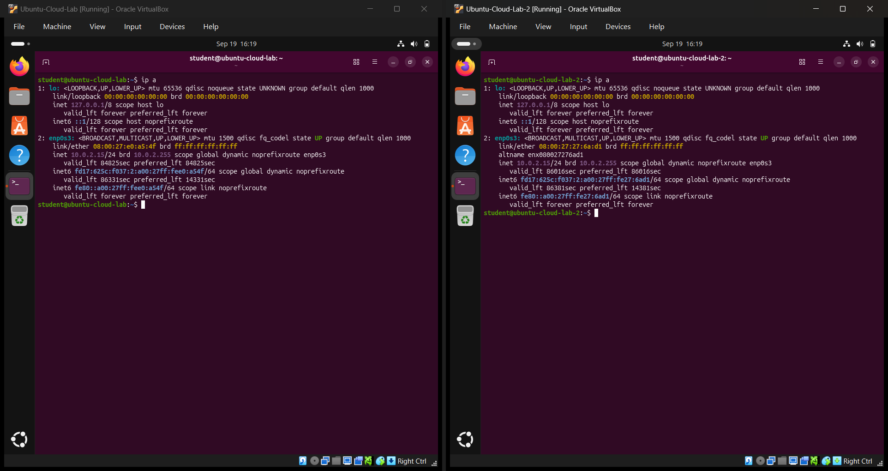
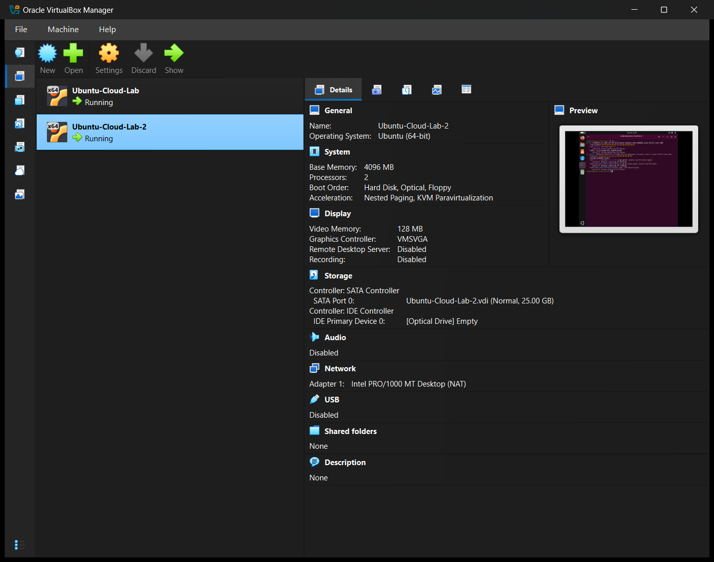
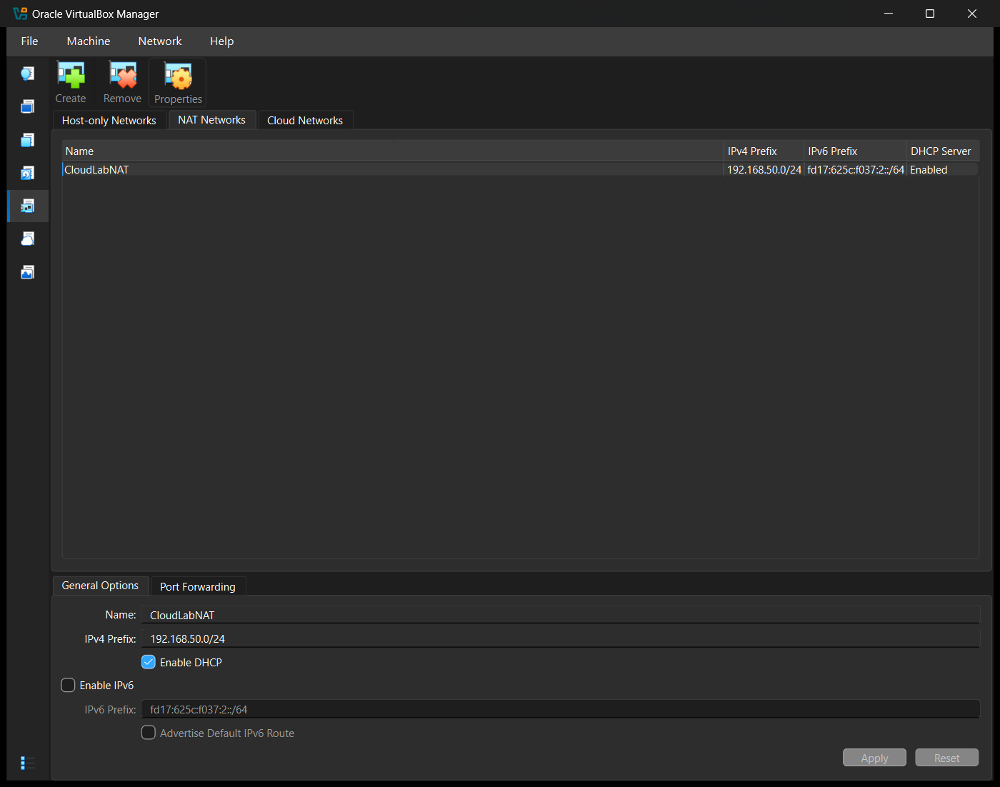
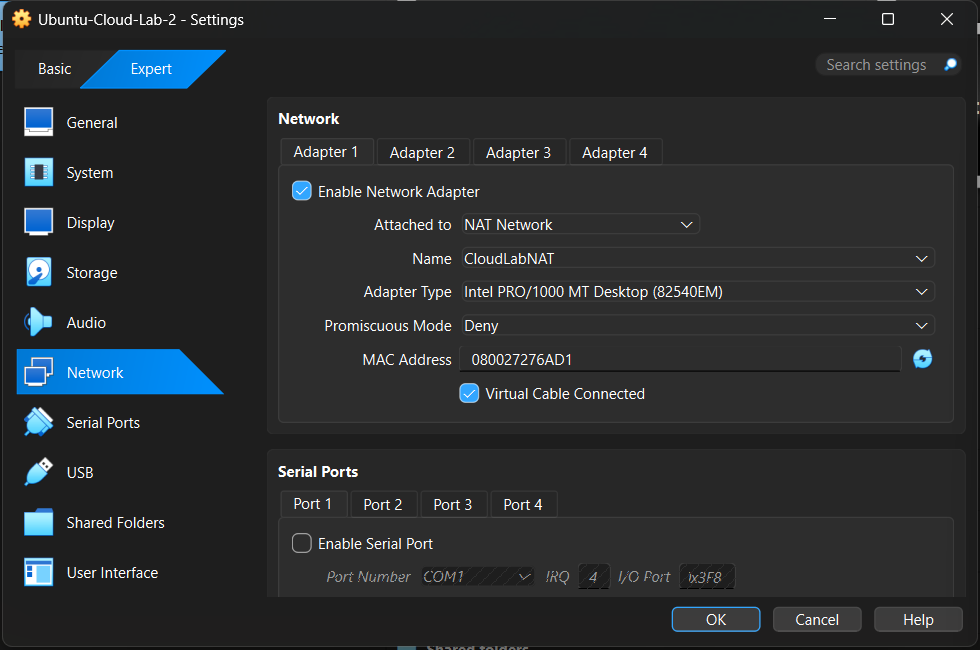
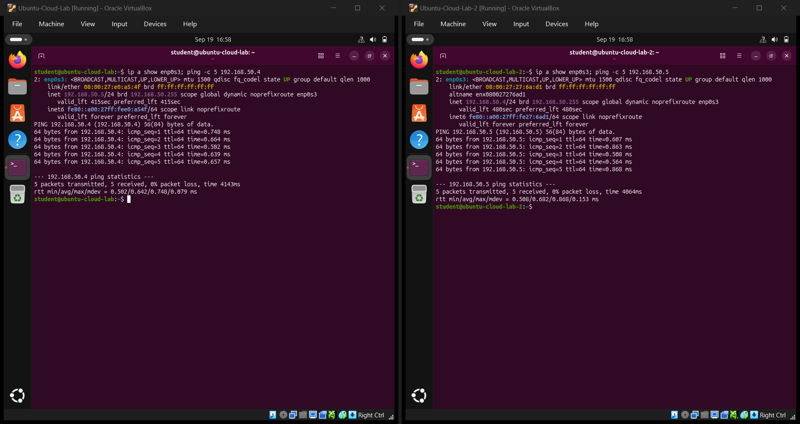
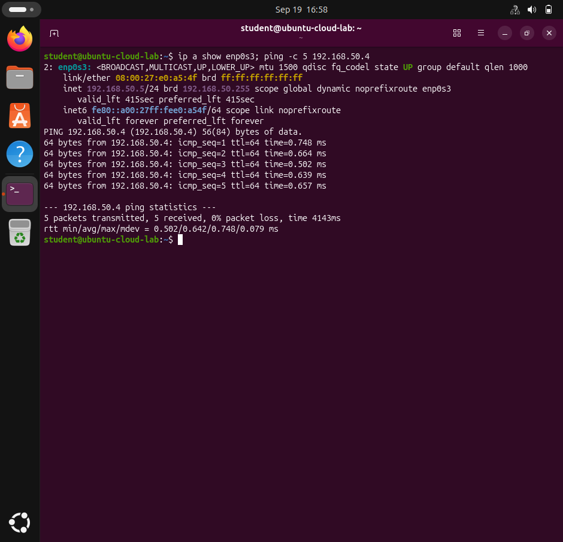
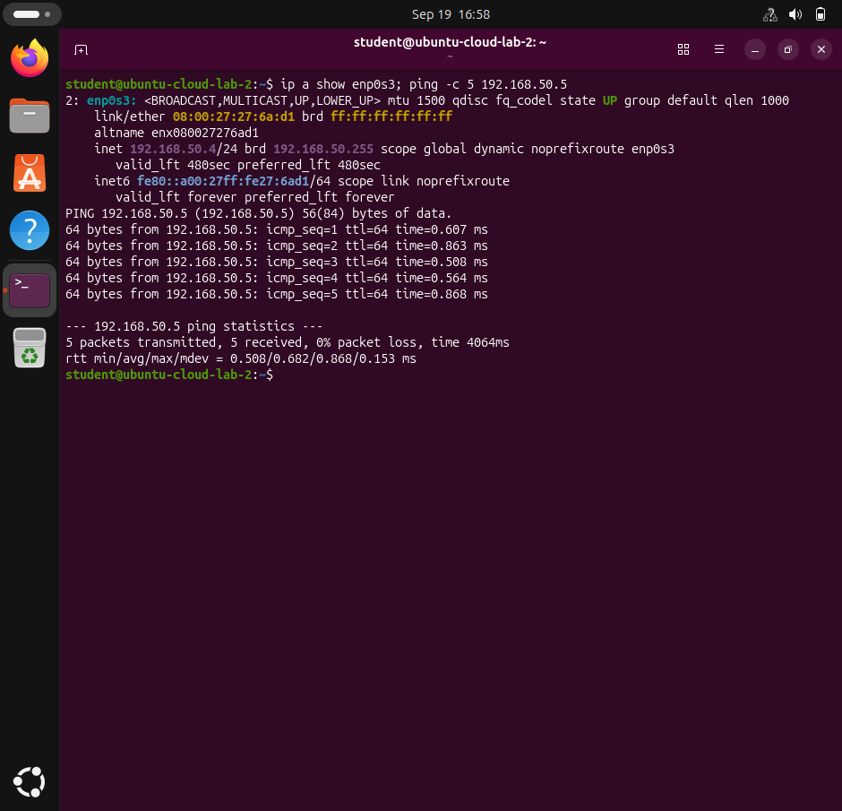

# Cloud Computing Lab — Experiment 2

## Connecting Two Virtual Machines Using a VirtualBox NAT Network

| Field | Details |
| --- | --- |
| Name | TODO: Add your name |
| Roll Number | TODO: Add your roll number |
| Section | BTECH_CSE_SECB_2023 |
| Course | Cloud Computing Lab |
| University | Adamas University (CSE, SOET) |
| Date of completion | 19 September 2026 |

## 1. Aim

Create two virtual machines, create a custom **NAT Network** in Oracle VirtualBox, attach both VMs to it, and verify that the VMs can communicate with each other using `ping`.

## 2. Theory

VirtualBox offers several networking modes for a VM's virtual network adapter:

| Mode | VM ↔ Internet | VM ↔ VM | Host ↔ VM |
| --- | --- | --- | --- |
| **NAT** (default) | Yes | **No** — every VM sits behind its own private NAT router | Port forwarding only |
| **NAT Network** | Yes | **Yes** — all VMs on the network share one virtual router and subnet | Port forwarding only |
| Bridged Adapter | Yes | Yes | Yes |
| Host-only Adapter | No | Yes | Yes |
| Internal Network | No | Yes | No |

With plain **NAT**, VirtualBox gives each VM its own isolated virtual router, so every VM receives the same address (`10.0.2.15`) and the VMs cannot reach one another. A **NAT Network** is a shared virtual switch plus router: VirtualBox's DHCP server hands each VM a unique address from one subnet (here `192.168.50.0/24`), so the VMs can talk to each other while still reaching the Internet through NAT. In a cloud this corresponds to placing instances in the same private subnet of a **VPC** (Virtual Private Cloud).

On a VirtualBox NAT Network the first addresses are reserved: `.1` is the gateway, `.2` the DHCP server, and `.3` the NAT engine's built-in DNS proxy.

## 3. Requirements

| Item | Value |
| --- | --- |
| Host OS | Windows 11 Home Single Language, 64-bit (Intel Core i7-12700H, 16 GB RAM) |
| Hypervisor | Oracle VirtualBox 7.2.18 |
| Guest OS (both VMs) | Ubuntu 26.04.1 LTS (kernel 7.0.0-31-generic) |

## 4. Configuration

### Virtual machines

| Setting | VM 1 | VM 2 |
| --- | --- | --- |
| Name | `Ubuntu-Cloud-Lab` | `Ubuntu-Cloud-Lab-2` (full clone of VM 1) |
| Hostname | `ubuntu-cloud-lab` | `ubuntu-cloud-lab-2` |
| CPU / RAM | 2 vCPU / 4096 MB | 2 vCPU / 4096 MB |
| Adapter 1 | Intel PRO/1000 MT Desktop, NAT Network `CloudLabNAT` | Intel PRO/1000 MT Desktop, NAT Network `CloudLabNAT` |
| MAC address | `08:00:27:E0:A5:4F` | `08:00:27:27:6A:D1` |
| IP on NAT (before) | `10.0.2.15` | `10.0.2.15` |
| IP on NAT Network (after) | **`192.168.50.5`** | **`192.168.50.4`** |

### NAT Network

| Setting | Value |
| --- | --- |
| Name | `CloudLabNAT` |
| IPv4 prefix | `192.168.50.0/24` |
| Gateway | `192.168.50.1` |
| DHCP | Enabled (server `192.168.50.2`, pool `192.168.50.4 – .254`) |
| IPv6 | Disabled |

The full configuration export is in [`network-configuration.txt`](network-configuration.txt).

## 5. Procedure

1. **Create 2 VMs.** VM 1 (`Ubuntu-Cloud-Lab`) is the Ubuntu VM from Experiment 1. VM 2 was created as a full clone with **new MAC addresses** (*Machine → Clone*, MAC policy "Generate new MAC addresses"), and its hostname and machine-id were changed so the two VMs are distinct hosts on the network.
   ```powershell
   VBoxManage clonevm Ubuntu-Cloud-Lab --name Ubuntu-Cloud-Lab-2 --mode machine --register
   ```
   ```bash
   # inside VM 2
   sudo hostnamectl set-hostname ubuntu-cloud-lab-2
   sudo rm /etc/machine-id && sudo systemd-machine-id-setup
   ```
2. **Check the IP addresses (`ifconfig` / `ip a`).** Started both VMs on the default NAT adapter and ran `ip a`. Both VMs showed the same address, `10.0.2.15/24`, because each one sits behind its own private NAT router.
3. **Create a custom NAT Network.** *File → Tools → Network → NAT Networks → Create*. Named it `CloudLabNAT`, IPv4 prefix `192.168.50.0/24`, **Enable DHCP** checked, then *Apply*.
   ```powershell
   VBoxManage natnetwork add --netname CloudLabNAT --network "192.168.50.0/24" --enable --dhcp on
   ```
4. **Attach VM 1 to the NAT Network.** *Machine → Settings → Expert → Network → Adapter 1 → Attached to: "NAT Network" → Name: `CloudLabNAT`* → OK.
5. **Do the same for VM 2.**
   ```powershell
   VBoxManage modifyvm Ubuntu-Cloud-Lab   --nic1 natnetwork --nat-network1 CloudLabNAT
   VBoxManage modifyvm Ubuntu-Cloud-Lab-2 --nic1 natnetwork --nat-network1 CloudLabNAT
   ```
6. **Shut down both VMs and power them on again**, so that each one requests a new address from the NAT Network's DHCP server.
7. **Check the new IP addresses** with `ip a`: VM 1 → `192.168.50.5`, VM 2 → `192.168.50.4`.
8. **Ping the VMs from each other**:
   ```bash
   # on VM 1
   ping -c 5 192.168.50.4
   # on VM 2
   ping -c 5 192.168.50.5
   ```

### Issue faced and fix

After the restart, VM 2 received `192.168.50.4`, but VM 1 stayed on *"getting IP configuration"*. NetworkManager's log showed that the DHCP server offered `192.168.50.3`, and the duplicate-address check then reported a conflict for it:

```text
dhcp4 (enp0s3): state changed new lease, address=192.168.50.3, acd conflict
```

`ip neigh` on VM 2 showed that `192.168.50.3` answers from the NAT engine's own MAC address (`52:54:00:12:35:00`), and the DHCP server configuration lists `192.168.50.3` as the network's DNS server (option 6). VirtualBox's DHCP pool for a new NAT Network starts at `.3`, which collides with its own DNS proxy address. The fix was to give VM 1 a DHCP reservation and move the pool so `.3` is never handed out:

```powershell
VBoxManage dhcpserver modify --network=CloudLabNAT --vm=Ubuntu-Cloud-Lab --nic=1 --fixed-address=192.168.50.5
VBoxManage dhcpserver modify --network=CloudLabNAT --lower-ip=192.168.50.4 --upper-ip=192.168.50.254
VBoxManage dhcpserver restart --network=CloudLabNAT
```

After reconnecting the interface (`nmcli device disconnect enp0s3 && nmcli device connect enp0s3`), VM 1 received `192.168.50.5`.

This also explains why the example in the assignment handout shows 100% packet loss. Its two VMs had the **same MAC address** (`08:00:27:13:c3:94`, a clone that kept its MAC), so they could not both work on the same network. Cloning with new MAC addresses avoids that problem.

## 6. Output

### Before — both VMs on default NAT

```text
student@ubuntu-cloud-lab:~$ ip a
2: enp0s3: <BROADCAST,MULTICAST,UP,LOWER_UP> mtu 1500 ... state UP
    link/ether 08:00:27:e0:a5:4f brd ff:ff:ff:ff:ff:ff
    inet 10.0.2.15/24 brd 10.0.2.255 scope global dynamic noprefixroute enp0s3

student@ubuntu-cloud-lab-2:~$ ip a
2: enp0s3: <BROADCAST,MULTICAST,UP,LOWER_UP> mtu 1500 ... state UP
    link/ether 08:00:27:27:6a:d1 brd ff:ff:ff:ff:ff:ff
    inet 10.0.2.15/24 brd 10.0.2.255 scope global dynamic noprefixroute enp0s3
```

### After — both VMs on NAT Network `CloudLabNAT`

```text
student@ubuntu-cloud-lab:~$ ip a show enp0s3; ping -c 5 192.168.50.4
    link/ether 08:00:27:e0:a5:4f brd ff:ff:ff:ff:ff:ff
    inet 192.168.50.5/24 brd 192.168.50.255 scope global dynamic noprefixroute enp0s3
PING 192.168.50.4 (192.168.50.4) 56(84) bytes of data.
64 bytes from 192.168.50.4: icmp_seq=1 ttl=64 time=0.748 ms
...
5 packets transmitted, 5 received, 0% packet loss, time 4143ms

student@ubuntu-cloud-lab-2:~$ ip a show enp0s3; ping -c 5 192.168.50.5
    link/ether 08:00:27:27:6a:d1 brd ff:ff:ff:ff:ff:ff
    inet 192.168.50.4/24 brd 192.168.50.255 scope global dynamic noprefixroute enp0s3
PING 192.168.50.5 (192.168.50.5) 56(84) bytes of data.
64 bytes from 192.168.50.5: icmp_seq=1 ttl=64 time=0.607 ms
...
5 packets transmitted, 5 received, 0% packet loss, time 4064ms
```

## 7. Screenshots

| # | Description | Screenshot |
| --- | --- | --- |
| 1 | Both VMs on default NAT — `ip a` shows `10.0.2.15` on each |  |
| 2 | Two VMs in VirtualBox Manager |  |
| 3 | NAT Network `CloudLabNAT` (192.168.50.0/24, DHCP enabled) created in File → Tools → Network |  |
| 4 | VM 1: Settings → Expert → Network → Attached to "NAT Network" → `CloudLabNAT` |  |
| 5 | VM 2: Settings → Expert → Network → Attached to "NAT Network" → `CloudLabNAT` |  |
| 6 | After restart: VM 1 (192.168.50.5) and VM 2 (192.168.50.4) ping each other with 0% packet loss |  |
| 7 | VM 1 → VM 2 ping (guest screen) |  |
| 8 | VM 2 → VM 1 ping (guest screen) |  |

## 8. Result

A custom NAT Network `CloudLabNAT` (`192.168.50.0/24`, DHCP enabled) was created in Oracle VirtualBox and both Ubuntu VMs were attached to it. After restarting, the VMs received unique addresses, `192.168.50.5` and `192.168.50.4`. Each VM successfully pinged the other with **5 packets transmitted, 5 received, 0% packet loss**.

## 9. Conclusion

With the default NAT mode every VM is isolated behind its own virtual router (all VMs get `10.0.2.15`) and cannot reach the others. Placing the VMs on a shared **NAT Network** puts them in one private subnet with a common gateway and DHCP server, so they can communicate with each other and still reach the Internet. This is the same model cloud providers use for instances inside a VPC subnet. The experiment also showed that cloned VMs need unique MAC addresses, and that reserved addresses (such as VirtualBox's DNS proxy at `.3`) must be kept out of the DHCP pool.
