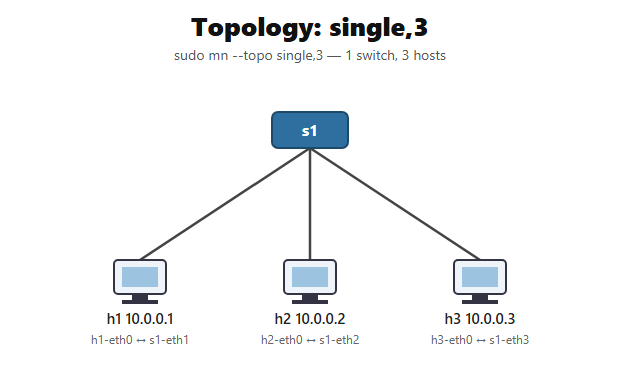
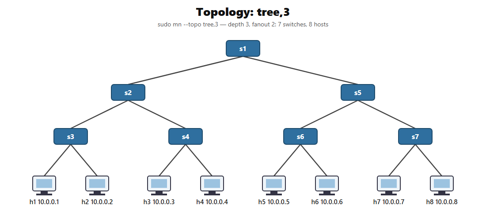
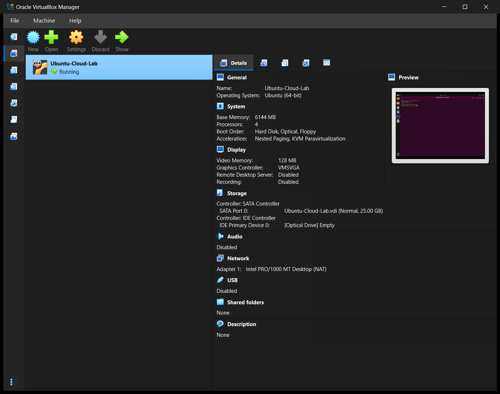
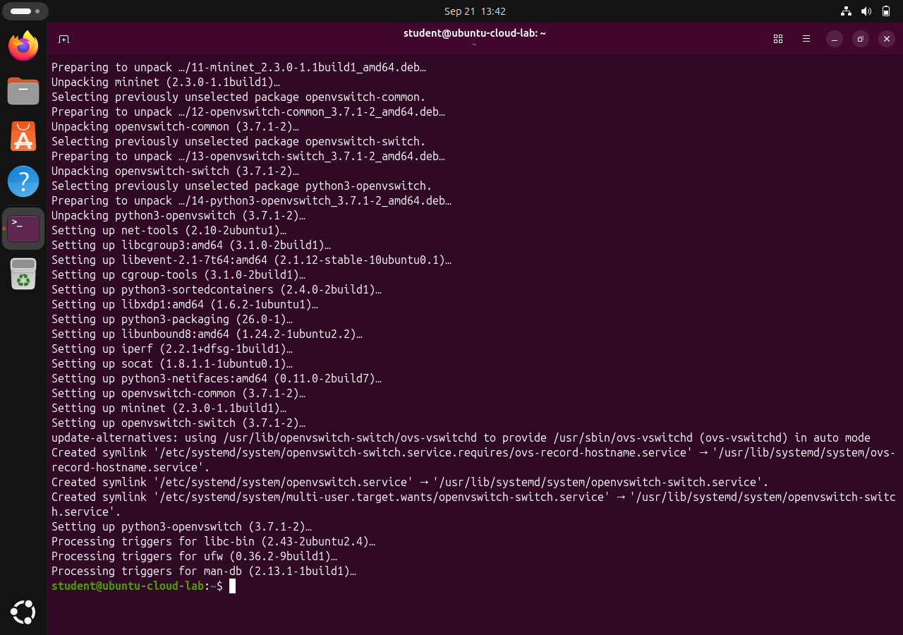
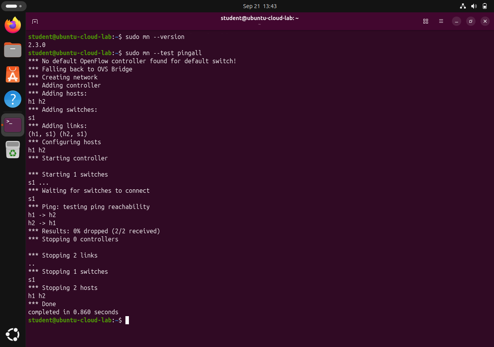
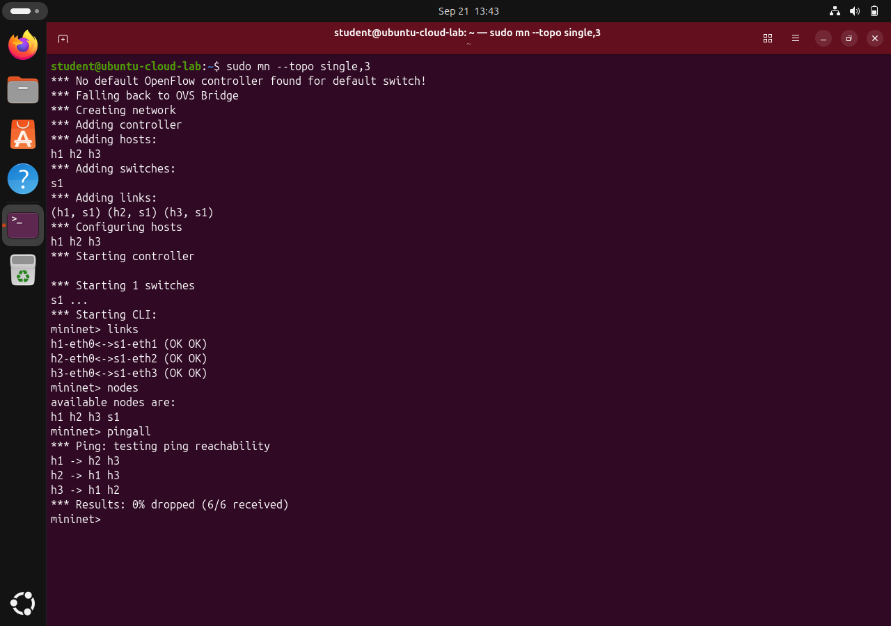
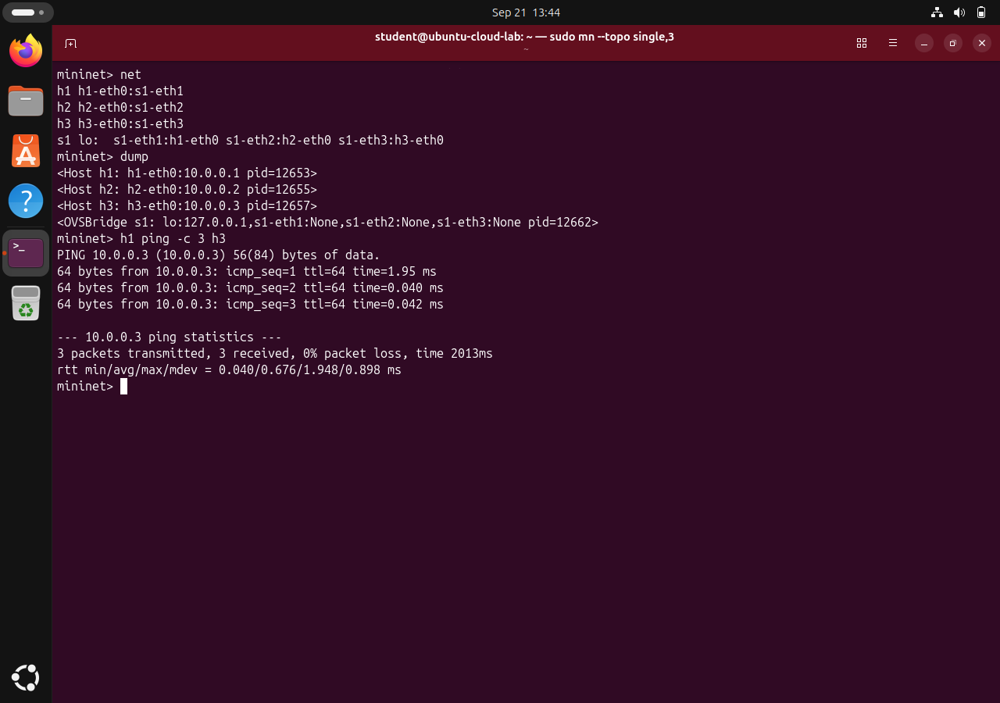
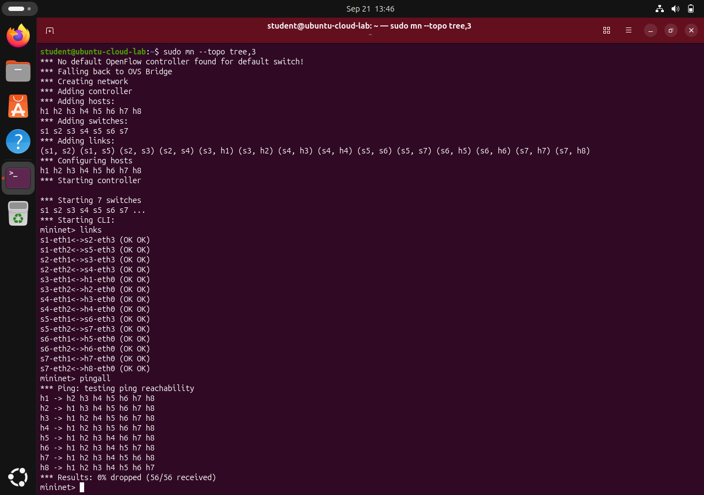

# Cloud Computing Lab — Experiment 3

## Network Emulation with Mininet: single and tree Topologies

| Field | Details |
| --- | --- |
| Name | TODO: Add your name |
| Roll Number | TODO: Add your roll number |
| Section | BTECH_CSE_SECB_2023 |
| Course | Cloud Computing Lab |
| University | Adamas University (CSE, SOET) |
| Date of completion | 21 September 2026 |

## 1. Aim

Install **Mininet** in the Ubuntu VM, verify the installation, and create and test the `single,3` and `tree,3` network topologies using the Mininet CLI commands `links`, `nodes`, `net`, `dump` and `pingall`.

## 2. Theory

**Mininet** is a network emulator that creates a realistic virtual network of hosts, switches, controllers and links on a single Linux machine. Each host is a lightweight process with its own network namespace, each link is a virtual Ethernet (veth) pair, and switches are software switches, by default **Open vSwitch (OVS)**. Mininet is widely used to prototype **Software-Defined Networking (SDN)**, where an OpenFlow controller programs the switches centrally. The same idea is used by cloud platforms to build virtual networks (VPCs, virtual switches, overlay networks) on shared physical hardware.

| Topology | Command | Structure |
| --- | --- | --- |
| minimal (default) | `sudo mn` | 1 switch, 2 hosts |
| single,N | `sudo mn --topo single,N` | 1 switch with N hosts attached |
| linear,N | `sudo mn --topo linear,N` | N switches in a chain, one host per switch |
| tree,D[,F] | `sudo mn --topo tree,D` | Tree of switches of depth D and fanout F (default 2), with hosts at the leaves: F^D hosts and (F^D − 1)/(F − 1) switches |

For `tree,3` (depth 3, fanout 2) this gives 2³ = **8 hosts** and 2³ − 1 = **7 switches**.

Useful Mininet CLI commands:

| Command | Purpose |
| --- | --- |
| `nodes` | List all nodes (hosts and switches) |
| `links` | List all links and their status |
| `net` | Show how each node's interfaces are connected |
| `dump` | Show each node's type, interfaces, IP address and process ID |
| `pingall` | Ping between every pair of hosts and report the drop rate |
| `h1 ping -c 3 h3` | Run a command (here `ping`) on a specific host |
| `exit` | Stop the network and leave the CLI |

## 3. Requirements

| Item | Value |
| --- | --- |
| Host | Windows 11, Oracle VirtualBox 7.2.18 |
| VM | `Ubuntu-Cloud-Lab`: Ubuntu 26.04.1 LTS, kernel 7.0.0-31-generic, 4 vCPU, 6144 MB RAM, 25 GB disk, NAT |
| Mininet | 2.3.0 (`mininet 2.3.0-1.1build1`) |
| Open vSwitch | 3.7.1 (`openvswitch-switch 3.7.1-2`) |

> Note: the VMs from Experiments 1 and 2 were stored in a folder that was later deleted, so the Ubuntu VM was rebuilt for this experiment. It uses the same configuration as Experiment 1 and was installed from the same checksum-verified Ubuntu 26.04.1 ISO.

## 4. Procedure

1. **Install Mininet** (see https://mininet.org/download/ — option 2, "Installation from Packages"):
   ```bash
   sudo apt update
   sudo apt install -y mininet
   ```
   This also installs Open vSwitch (`openvswitch-switch`), which Mininet uses for its switches.
2. **Verify the installation** and run Mininet's built-in test, which builds the minimal topology (h1–s1–h2) and pings between the hosts:
   ```bash
   sudo mn --version
   sudo mn --test pingall
   ```
3. **Create the `single,3` topology** (one switch s1 with hosts h1, h2 and h3) and inspect it from the Mininet CLI:
   ```text
   sudo mn --topo single,3
   mininet> links
   mininet> nodes
   mininet> pingall
   mininet> net
   mininet> dump
   mininet> h1 ping -c 3 h3
   mininet> exit
   ```
4. **Create the `tree,3` topology** (depth 3, fanout 2) and test it:
   ```text
   sudo mn --topo tree,3
   mininet> links
   mininet> pingall
   mininet> exit
   ```
5. **Clean up** any leftover Mininet state:
   ```bash
   sudo mn -c
   ```

No OpenFlow controller is installed, so Mininet reports *"No default OpenFlow controller found for default switch! Falling back to OVS Bridge"*. The switches then run as standard learning Ethernet bridges, which is enough for these reachability tests. The assignment's reference output shows the same message.

## 5. Topology Diagrams





## 6. Output

### Version and built-in test

```text
student@ubuntu-cloud-lab:~$ sudo mn --version
2.3.0
student@ubuntu-cloud-lab:~$ sudo mn --test pingall
*** No default OpenFlow controller found for default switch!
*** Falling back to OVS Bridge
*** Creating network
*** Adding hosts:
h1 h2
*** Adding switches:
s1
*** Adding links:
(h1, s1) (h2, s1)
...
*** Ping: testing ping reachability
h1 -> h2
h2 -> h1
*** Results: 0% dropped (2/2 received)
...
*** Done
completed in 0.860 seconds
```

### single,3

```text
student@ubuntu-cloud-lab:~$ sudo mn --topo single,3
*** Adding hosts:
h1 h2 h3
*** Adding switches:
s1
*** Adding links:
(h1, s1) (h2, s1) (h3, s1)
...
mininet> links
h1-eth0<->s1-eth1 (OK OK)
h2-eth0<->s1-eth2 (OK OK)
h3-eth0<->s1-eth3 (OK OK)
mininet> nodes
available nodes are:
h1 h2 h3 s1
mininet> pingall
*** Ping: testing ping reachability
h1 -> h2 h3
h2 -> h1 h3
h3 -> h1 h2
*** Results: 0% dropped (6/6 received)
mininet> net
h1 h1-eth0:s1-eth1
h2 h2-eth0:s1-eth2
h3 h3-eth0:s1-eth3
s1 lo:  s1-eth1:h1-eth0 s1-eth2:h2-eth0 s1-eth3:h3-eth0
mininet> dump
<Host h1: h1-eth0:10.0.0.1 pid=12653>
<Host h2: h2-eth0:10.0.0.2 pid=12655>
<Host h3: h3-eth0:10.0.0.3 pid=12657>
<OVSBridge s1: lo:127.0.0.1,s1-eth1:None,s1-eth2:None,s1-eth3:None pid=12662>
mininet> h1 ping -c 3 h3
3 packets transmitted, 3 received, 0% packet loss, time 2013ms
```

### tree,3

```text
student@ubuntu-cloud-lab:~$ sudo mn --topo tree,3
*** Adding hosts:
h1 h2 h3 h4 h5 h6 h7 h8
*** Adding switches:
s1 s2 s3 s4 s5 s6 s7
*** Adding links:
(s1, s2) (s1, s5) (s2, s3) (s2, s4) (s3, h1) (s3, h2) (s4, h3) (s4, h4) (s5, s6) (s5, s7) (s6, h5) (s6, h6) (s7, h7) (s7, h8)
...
*** Starting 7 switches
mininet> links
s1-eth1<->s2-eth3 (OK OK)
s1-eth2<->s5-eth3 (OK OK)
s2-eth1<->s3-eth3 (OK OK)
s2-eth2<->s4-eth3 (OK OK)
s3-eth1<->h1-eth0 (OK OK)
s3-eth2<->h2-eth0 (OK OK)
s4-eth1<->h3-eth0 (OK OK)
s4-eth2<->h4-eth0 (OK OK)
s5-eth1<->s6-eth3 (OK OK)
s5-eth2<->s7-eth3 (OK OK)
s6-eth1<->h5-eth0 (OK OK)
s6-eth2<->h6-eth0 (OK OK)
s7-eth1<->h7-eth0 (OK OK)
s7-eth2<->h8-eth0 (OK OK)
mininet> pingall
*** Ping: testing ping reachability
h1 -> h2 h3 h4 h5 h6 h7 h8
h2 -> h1 h3 h4 h5 h6 h7 h8
h3 -> h1 h2 h4 h5 h6 h7 h8
h4 -> h1 h2 h3 h5 h6 h7 h8
h5 -> h1 h2 h3 h4 h6 h7 h8
h6 -> h1 h2 h3 h4 h5 h7 h8
h7 -> h1 h2 h3 h4 h5 h6 h8
h8 -> h1 h2 h3 h4 h5 h6 h7
*** Results: 0% dropped (56/56 received)
```

## 7. Screenshots

| # | Description | Screenshot |
| --- | --- | --- |
| 0 | Ubuntu VM running in Oracle VirtualBox |  |
| 1 | Installing Mininet and Open vSwitch with `sudo apt install -y mininet` |  |
| 2 | `sudo mn --version` and `sudo mn --test pingall` (0% dropped, 2/2) |  |
| 3 | `sudo mn --topo single,3` with `links`, `nodes`, `pingall` (0% dropped, 6/6) |  |
| 4 | single,3: `net`, `dump`, `h1 ping -c 3 h3` |  |
| 5 | `sudo mn --topo tree,3` with `links` and `pingall` (0% dropped, 56/56) |  |

## 8. Result

Mininet 2.3.0 was installed in the Ubuntu 26.04.1 VM along with Open vSwitch 3.7.1. The built-in test passed (2/2 received). The `single,3` topology (1 switch, 3 hosts, 3 links) and the `tree,3` topology (7 switches, 8 hosts, 14 links) were created, all links reported `(OK OK)`, and `pingall` reported **0% dropped** in both cases: 6/6 packets for single,3 and 56/56 packets for tree,3.

## 9. Conclusion

Mininet lets a complete network of hosts, switches and links be emulated inside one virtual machine, using Linux network namespaces for hosts, veth pairs for links and Open vSwitch for switches. Changing a single command-line option (`--topo single,3` or `--topo tree,3`) builds a different topology in seconds, and the CLI commands `links`, `nodes`, `net`, `dump` and `pingall` make it easy to inspect and verify the network. This software-defined, reproducible way of building networks is the same principle cloud providers use for the virtual networks behind their VMs and containers.
