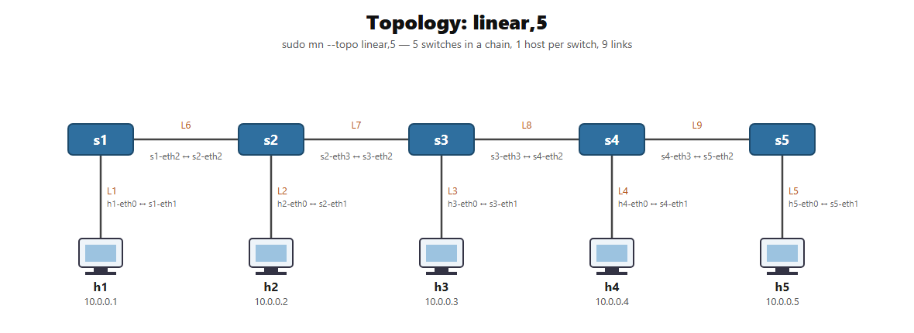
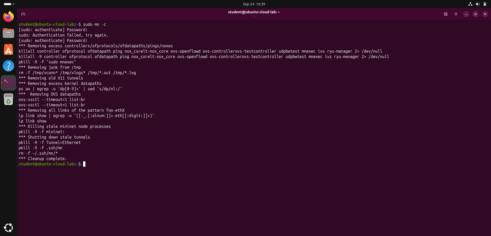
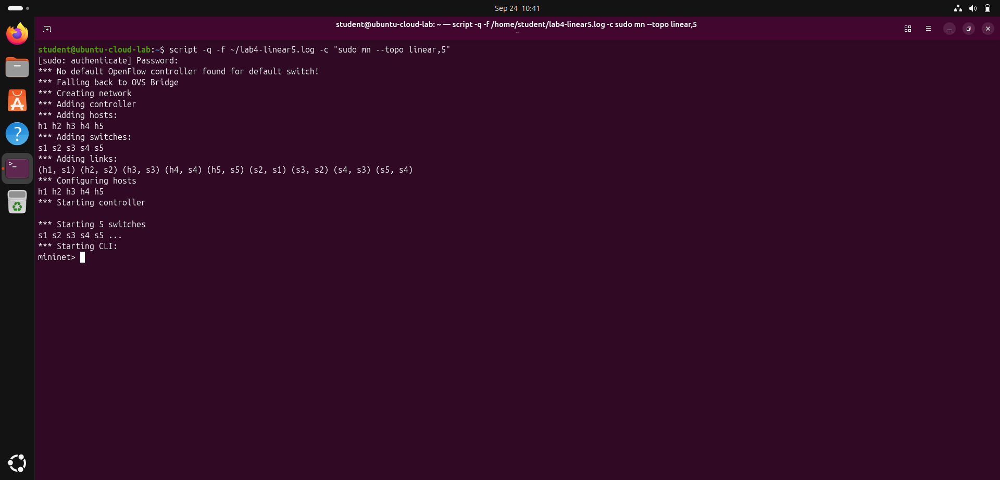
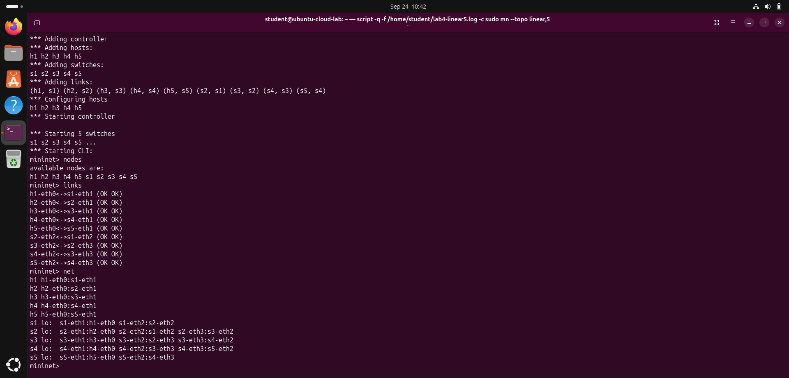
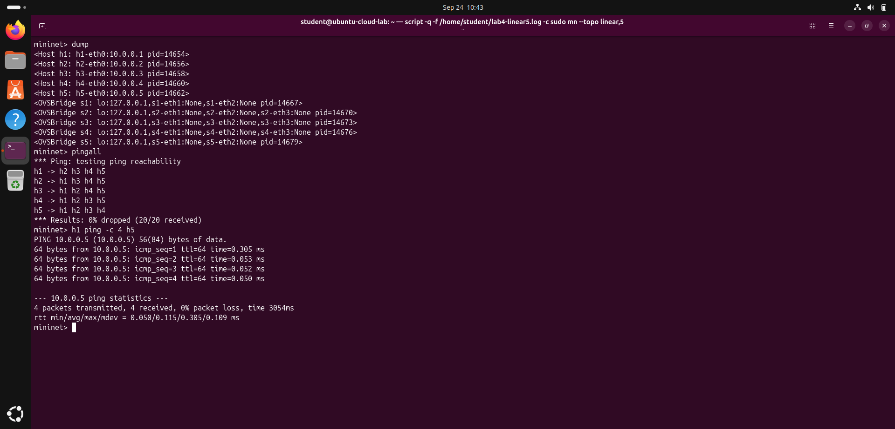
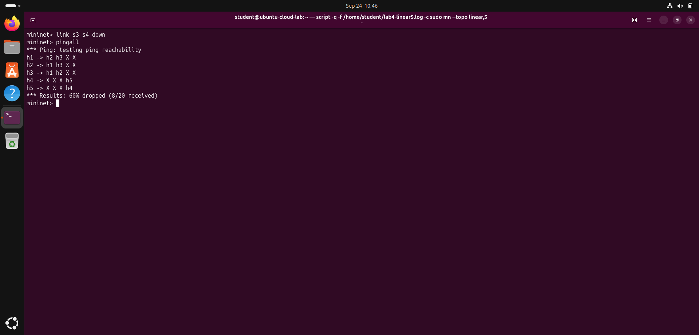
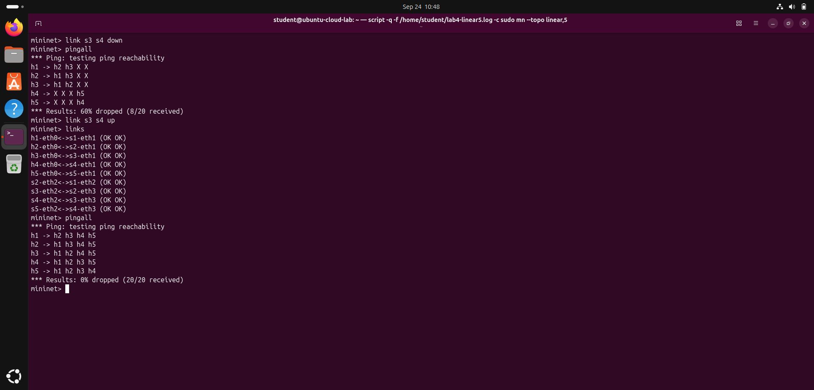

# Cloud Computing Lab — Experiment 4

## Linear Topology with Five Switches in Mininet

| Field | Details |
| --- | --- |
| Name | TODO: Add your name |
| Roll Number | TODO: Add your roll number |
| Section | BTECH_CSE_SECB_2023 |
| Course | Cloud Computing Lab |
| University | Adamas University (CSE, SOET) |
| Date of completion | 24 September 2026 |

## 1. Problem Statement

A company wants to simulate a network in which multiple switches are connected sequentially, with each switch linked to the next one. To study the connectivity and communication flow in such an arrangement, the administrator decides to use **five switches in a linear topology**. Create and demonstrate this topology, show the links between the switches, explain each link, and explain every step followed to design and implement it, including the connections, configurations and commands used.

## 2. Aim

Design, implement and demonstrate a **linear topology of five switches** in Mininet; list and explain every link; verify end-to-end communication between all hosts; and study how traffic flows along the chain, including what happens when one of the switch-to-switch links fails.

## 3. Theory

### Linear topology

In a **linear (daisy-chain / bus-style) topology** each switch is connected only to the switch before it and the switch after it. There is exactly **one path** between any two nodes:

```text
h1        h2        h3        h4        h5
 |         |         |         |         |
s1 ─────  s2 ─────  s3 ─────  s4 ─────  s5
```

| Property | Behaviour in a linear topology |
| --- | --- |
| Number of switch-to-switch links | N − 1 (here 5 − 1 = **4**) |
| Path between two hosts | Unique — traffic must pass through every switch in between |
| Hops from h1 to h5 | 5 switches, i.e. the longest path in the network |
| Redundancy | **None** — a single link failure splits the network into two isolated halves |
| Loops | None, so no spanning tree is needed |
| Typical use | Simple chained deployments: switches along a corridor, floor-by-floor wiring, industrial/ring-less field networks |

This is the trade-off the administrator is studying: a linear chain is cheap and simple to cable, but latency grows with distance along the chain and there is no backup path.

### Mininet's `linear,N` topology

Mininet's built-in `linear` topology creates **N switches in a chain and attaches exactly one host to each switch**. So `--topo linear,5` gives:

- 5 switches: `s1 s2 s3 s4 s5`
- 5 hosts: `h1 h2 h3 h4 h5` with IP addresses `10.0.0.1` … `10.0.0.5/8`
- 9 links: 5 host-to-switch links + 4 switch-to-switch links

Each host is a process in its own network namespace, each link is a **veth (virtual Ethernet) pair**, and each switch is an **Open vSwitch** bridge. Because no OpenFlow controller is installed, Mininet prints *"No default OpenFlow controller found… Falling back to OVS Bridge"* and the switches behave as normal learning Ethernet bridges — they flood a frame the first time and then learn which port each MAC address is on.

## 4. Setup Used

| Item | Value |
| --- | --- |
| Host | Windows 11, Oracle VirtualBox 7.2.18 |
| VM | `Ubuntu-Cloud-Lab` — Ubuntu 26.04.1 LTS, kernel 7.0.0-31-generic, 4 vCPU, 6 GB RAM |
| Mininet | 2.3.0 |
| Open vSwitch | 3.7.1 |

Mininet and Open vSwitch were installed in Experiment 3 with `sudo apt install -y mininet`.

## 5. Design of the Topology

**Addressing and naming plan** (Mininet's defaults, no manual configuration needed):

| Node | Type | Interface(s) | IP address |
| --- | --- | --- | --- |
| h1 … h5 | Host (network namespace) | `hN-eth0` | `10.0.0.N/8` |
| s1 | OVS bridge (chain end) | `s1-eth1` (host), `s1-eth2` (to s2) | — (bridges work at layer 2) |
| s2, s3, s4 | OVS bridge (middle) | `sN-eth1` (host), `sN-eth2` (to previous), `sN-eth3` (to next) | — |
| s5 | OVS bridge (chain end) | `s5-eth1` (host), `s5-eth2` (to s4) | — |

Note the port numbering rule that comes out of this design: **eth1 always faces the host, eth2 always faces the previous switch, and eth3 always faces the next switch.** The two ends of the chain (s1 and s5) have no "previous"/"next" neighbour respectively, so they use one port less.

## 6. Procedure — every step followed

### Step 1 — Start the VM and open a terminal

The Ubuntu VM was started in VirtualBox and a terminal opened (`Ctrl + Alt + T`).

### Step 2 — Clean up any previous Mininet state

Mininet leaves behind switches, veth interfaces and host processes if an earlier run was not closed properly, so the environment is cleared first:

```bash
sudo mn -c
```

Output ends with `*** Cleanup complete.`

### Step 3 — Create the linear topology with five switches

```bash
sudo mn --topo linear,5
```

Optionally, the whole session can be recorded to a file for the lab record:

```bash
script -q -f ~/lab4-linear5.log -c "sudo mn --topo linear,5"
```

What each part of the command means:

| Part | Meaning |
| --- | --- |
| `sudo` | Creating network namespaces, veth pairs and OVS bridges needs root privileges |
| `mn` | The Mininet command-line tool |
| `--topo` | Selects which built-in topology to build |
| `linear,5` | The `linear` topology with parameter N = 5 → 5 switches chained, 1 host per switch |

Mininet then reports each construction phase: *Adding hosts → Adding switches → Adding links → Configuring hosts (IP addresses) → Starting controller → Starting 5 switches → Starting CLI*.

### Step 4 — List the nodes

```text
mininet> nodes
available nodes are:
h1 h2 h3 h4 h5 s1 s2 s3 s4 s5
```

Five hosts and five switches exist, as designed.

### Step 5 — Show the links between the switches

```text
mininet> links
```

This prints all 9 links with their status `(OK OK)`, meaning both ends of each veth pair are up.

### Step 6 — Show how the interfaces are connected

```text
mininet> net
```

`net` shows the connection from the point of view of each node, which makes the chain obvious: s2, s3 and s4 each have three interfaces (one host, one to the left, one to the right), while s1 and s5 have only two.

### Step 7 — Show node details

```text
mininet> dump
```

`dump` lists each host with its IP address and process ID, and each switch as an `OVSBridge`.

### Step 8 — Test full connectivity

```text
mininet> pingall
```

Every host pings every other host: 5 × 4 = 20 pings, result **0% dropped (20/20 received)**.

### Step 9 — Test the longest path in the chain

```text
mininet> h1 ping -c 4 h5
```

This is the worst case for a linear topology: the packet goes h1 → s1 → s2 → s3 → s4 → s5 → h5 and back. All 4 packets were received, 0% loss.

### Step 10 — Study the communication flow: break a link in the middle

```text
mininet> link s3 s4 down
mininet> pingall
```

With link **L8 (s3 ↔ s4)** down, the chain is cut into two isolated segments — {h1, h2, h3} and {h4, h5}. Result: **60% dropped (8/20 received)**. This demonstrates the biggest weakness of a linear topology: there is no alternative path, so one broken link partitions the network.

### Step 11 — Restore the link and confirm recovery

```text
mininet> link s3 s4 up
mininet> links
mininet> pingall
```

All links show `(OK OK)` again and connectivity returns to **0% dropped (20/20 received)**.

### Step 12 — Exit and clean up (when the demonstration is finished)

```text
mininet> exit
```
```bash
sudo mn -c
```

## 7. The Links and What Each One Does

Output of `mininet> links`:

```text
h1-eth0<->s1-eth1 (OK OK)
h2-eth0<->s2-eth1 (OK OK)
h3-eth0<->s3-eth1 (OK OK)
h4-eth0<->s4-eth1 (OK OK)
h5-eth0<->s5-eth1 (OK OK)
s2-eth2<->s1-eth2 (OK OK)
s3-eth2<->s2-eth3 (OK OK)
s4-eth2<->s3-eth3 (OK OK)
s5-eth2<->s4-eth3 (OK OK)
```

### Host-to-switch links (access links)

| Link | Connection | Explanation |
| --- | --- | --- |
| L1 | `h1-eth0 ↔ s1-eth1` | Connects host h1 (10.0.0.1) to the first switch of the chain. This is h1's only way into the network. |
| L2 | `h2-eth0 ↔ s2-eth1` | Connects h2 (10.0.0.2) to s2, the second switch. |
| L3 | `h3-eth0 ↔ s3-eth1` | Connects h3 (10.0.0.3) to s3, the middle switch of the chain. |
| L4 | `h4-eth0 ↔ s4-eth1` | Connects h4 (10.0.0.4) to s4. |
| L5 | `h5-eth0 ↔ s5-eth1` | Connects h5 (10.0.0.5) to s5, the last switch of the chain. |

### Switch-to-switch links (trunk / backbone links)

| Link | Connection | Explanation |
| --- | --- | --- |
| L6 | `s1-eth2 ↔ s2-eth2` | Joins switch 1 to switch 2. All traffic leaving the h1 segment towards any other host crosses this link. |
| L7 | `s2-eth3 ↔ s3-eth2` | Joins switch 2 to switch 3. Carries traffic between the {h1, h2} side and the {h3, h4, h5} side. |
| L8 | `s3-eth3 ↔ s4-eth2` | Joins switch 3 to switch 4. This is the middle of the chain — the link that was taken down in Step 10 to split the network. |
| L9 | `s4-eth3 ↔ s5-eth2` | Joins switch 4 to switch 5, the last hop of the chain, used by every packet destined for h5. |

Each link is a **veth pair**: two virtual interfaces joined back to back, so whatever is transmitted on one end is received on the other, exactly like a physical cable between two switch ports. `(OK OK)` means both ends are administratively and operationally up.

### Communication flow along the chain

| Traffic | Path | Links used |
| --- | --- | --- |
| h1 → h2 | h1 → s1 → s2 → h2 | L1, L6, L2 |
| h1 → h3 | h1 → s1 → s2 → s3 → h3 | L1, L6, L7, L3 |
| h1 → h5 | h1 → s1 → s2 → s3 → s4 → s5 → h5 | L1, L6, L7, L8, L9, L5 |
| h4 → h5 | h4 → s4 → s5 → h5 | L4, L9, L5 |

Because each switch is a learning bridge, the first frame to an unknown destination is flooded out of all other ports; the switch then learns the source MAC address and port, so later frames are forwarded only along the chain towards the destination. The number of links crossed grows with the distance between hosts, which is why h1 → h5 shows a slightly higher round-trip time on the first ping (0.305 ms) than the later ones (≈ 0.05 ms), once the MAC addresses have been learned and the ARP entries cached.

## 8. Topology Diagram



## 9. Output

The complete recorded session is saved in [`linear5-session.log`](linear5-session.log).

### Creating the topology

```text
student@ubuntu-cloud-lab:~$ sudo mn --topo linear,5
*** No default OpenFlow controller found for default switch!
*** Falling back to OVS Bridge
*** Creating network
*** Adding controller
*** Adding hosts:
h1 h2 h3 h4 h5
*** Adding switches:
s1 s2 s3 s4 s5
*** Adding links:
(h1, s1) (h2, s2) (h3, s3) (h4, s4) (h5, s5) (s2, s1) (s3, s2) (s4, s3) (s5, s4)
*** Configuring hosts
h1 h2 h3 h4 h5
*** Starting controller

*** Starting 5 switches
s1 s2 s3 s4 s5 ...
*** Starting CLI:
```

### Nodes, links and interface map

```text
mininet> nodes
available nodes are:
h1 h2 h3 h4 h5 s1 s2 s3 s4 s5
mininet> links
h1-eth0<->s1-eth1 (OK OK)
h2-eth0<->s2-eth1 (OK OK)
h3-eth0<->s3-eth1 (OK OK)
h4-eth0<->s4-eth1 (OK OK)
h5-eth0<->s5-eth1 (OK OK)
s2-eth2<->s1-eth2 (OK OK)
s3-eth2<->s2-eth3 (OK OK)
s4-eth2<->s3-eth3 (OK OK)
s5-eth2<->s4-eth3 (OK OK)
mininet> net
h1 h1-eth0:s1-eth1
h2 h2-eth0:s2-eth1
h3 h3-eth0:s3-eth1
h4 h4-eth0:s4-eth1
h5 h5-eth0:s5-eth1
s1 lo:  s1-eth1:h1-eth0 s1-eth2:s2-eth2
s2 lo:  s2-eth1:h2-eth0 s2-eth2:s1-eth2 s2-eth3:s3-eth2
s3 lo:  s3-eth1:h3-eth0 s3-eth2:s2-eth3 s3-eth3:s4-eth2
s4 lo:  s4-eth1:h4-eth0 s4-eth2:s3-eth3 s4-eth3:s5-eth2
s5 lo:  s5-eth1:h5-eth0 s5-eth2:s4-eth3
```

### Node details

```text
mininet> dump
<Host h1: h1-eth0:10.0.0.1 pid=14654>
<Host h2: h2-eth0:10.0.0.2 pid=14656>
<Host h3: h3-eth0:10.0.0.3 pid=14658>
<Host h4: h4-eth0:10.0.0.4 pid=14660>
<Host h5: h5-eth0:10.0.0.5 pid=14662>
<OVSBridge s1: lo:127.0.0.1,s1-eth1:None,s1-eth2:None pid=14667>
<OVSBridge s2: lo:127.0.0.1,s2-eth1:None,s2-eth2:None,s2-eth3:None pid=14670>
<OVSBridge s3: lo:127.0.0.1,s3-eth1:None,s3-eth2:None,s3-eth3:None pid=14673>
<OVSBridge s4: lo:127.0.0.1,s4-eth1:None,s4-eth2:None,s4-eth3:None pid=14676>
<OVSBridge s5: lo:127.0.0.1,s5-eth1:None,s5-eth2:None pid=14679>
```

### Connectivity test

```text
mininet> pingall
*** Ping: testing ping reachability
h1 -> h2 h3 h4 h5
h2 -> h1 h3 h4 h5
h3 -> h1 h2 h4 h5
h4 -> h1 h2 h3 h5
h5 -> h1 h2 h3 h4
*** Results: 0% dropped (20/20 received)

mininet> h1 ping -c 4 h5
PING 10.0.0.5 (10.0.0.5) 56(84) bytes of data.
64 bytes from 10.0.0.5: icmp_seq=1 ttl=64 time=0.305 ms
64 bytes from 10.0.0.5: icmp_seq=2 ttl=64 time=0.053 ms
64 bytes from 10.0.0.5: icmp_seq=3 ttl=64 time=0.052 ms
64 bytes from 10.0.0.5: icmp_seq=4 ttl=64 time=0.050 ms
4 packets transmitted, 4 received, 0% packet loss, time 3054ms
rtt min/avg/max/mdev = 0.050/0.115/0.305/0.109 ms
```

### Link failure in the middle of the chain

```text
mininet> link s3 s4 down
mininet> pingall
*** Ping: testing ping reachability
h1 -> h2 h3 X X
h2 -> h1 h3 X X
h3 -> h1 h2 X X
h4 -> X X X h5
h5 -> X X X h4
*** Results: 60% dropped (8/20 received)
```

### After restoring the link

```text
mininet> link s3 s4 up
mininet> pingall
*** Ping: testing ping reachability
h1 -> h2 h3 h4 h5
h2 -> h1 h3 h4 h5
h3 -> h1 h2 h4 h5
h4 -> h1 h2 h3 h5
h5 -> h1 h2 h3 h4
*** Results: 0% dropped (20/20 received)
```

## 10. Screenshots

| # | Description | Screenshot |
| --- | --- | --- |
| 1 | `sudo mn -c` — clearing any previous Mininet state |  |
| 2 | `sudo mn --topo linear,5` — 5 hosts, 5 switches and 9 links created |  |
| 3 | `nodes`, `links` and `net` — the chain and all 9 links `(OK OK)` |  |
| 4 | `dump`, `pingall` (20/20) and `h1 ping -c 4 h5` across all five switches |  |
| 5 | `link s3 s4 down` — the chain splits, 60% dropped (8/20) |  |
| 6 | `link s3 s4 up` — all links `(OK OK)` again, 0% dropped (20/20) |  |

## 11. Result

A linear topology of **five switches** (`s1 – s2 – s3 – s4 – s5`) with one host per switch was created in Mininet with `sudo mn --topo linear,5`. All **9 links** (5 host-to-switch and 4 switch-to-switch) came up with status `(OK OK)`, and `pingall` reported **0% dropped (20/20 received)**, confirming that every host can reach every other host along the chain. A ping from h1 to h5, the longest path, succeeded with 0% packet loss. Taking the middle link `s3 ↔ s4` down split the network into {h1, h2, h3} and {h4, h5} with **60% dropped (8/20 received)**, and bringing the link back up restored full connectivity to **0% dropped (20/20 received)**.

## 12. Conclusion

The experiment shows both properties of a sequential (linear) switch arrangement that the administrator wanted to study:

1. **Connectivity** — a chain of five switches provides full reachability between all hosts with only N − 1 = 4 backbone links, the smallest number of links that can keep N switches connected.
2. **Communication flow** — traffic must traverse every intermediate switch, so the number of hops and the delay grow with the distance along the chain; h1 → h5 crosses all five switches, while neighbouring hosts cross only one backbone link.
3. **No redundancy** — because there is exactly one path between any two nodes, a single failed link (here `s3 ↔ s4`) partitions the network into two isolated halves, as the 60% drop rate proved.

For a production network the administrator should therefore add a redundant path (for example a ring or a tree with dual uplinks, protected by the spanning tree protocol) rather than relying on a pure linear chain. Mininet made it possible to build, test and break this five-switch network in seconds with a single command, which is exactly how software-defined and cloud networks are prototyped before being deployed on real hardware.
